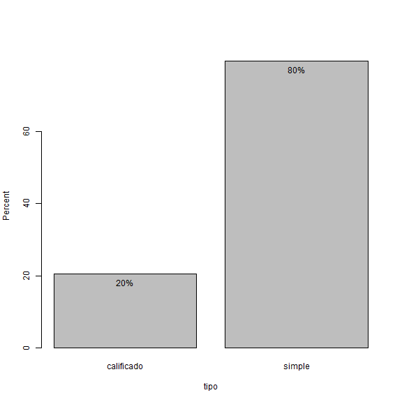

<!-- R Commander Markdown Template -->

Replace with Main Title
=======================

### Your Name

### 2021-10-18


```r
> Robos <- readXL("d:/Datos User/Desktop/Datos esc/ISEP/tsad_est1/base_robos.xlsx", rownames=FALSE, 
+   header=TRUE, na="", sheet="base", stringsAsFactors=TRUE)
```


```r
> with(Robos, Barplot(tipo, xlab="tipo", ylab="Percent", scale="percent", label.bars=TRUE))
```




```r
> Robos$agres_f <- with(Robos, factor(agres, levels=c('Bajo','Medio','Alto'), ordered=TRUE))
```


