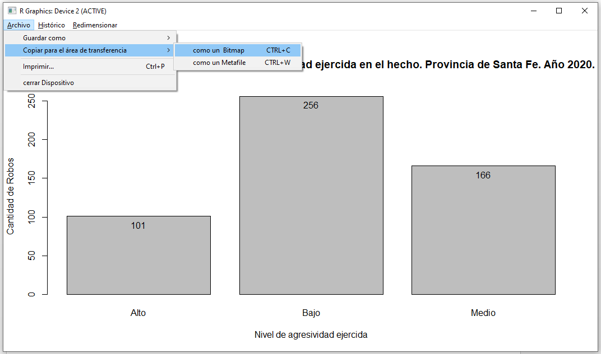
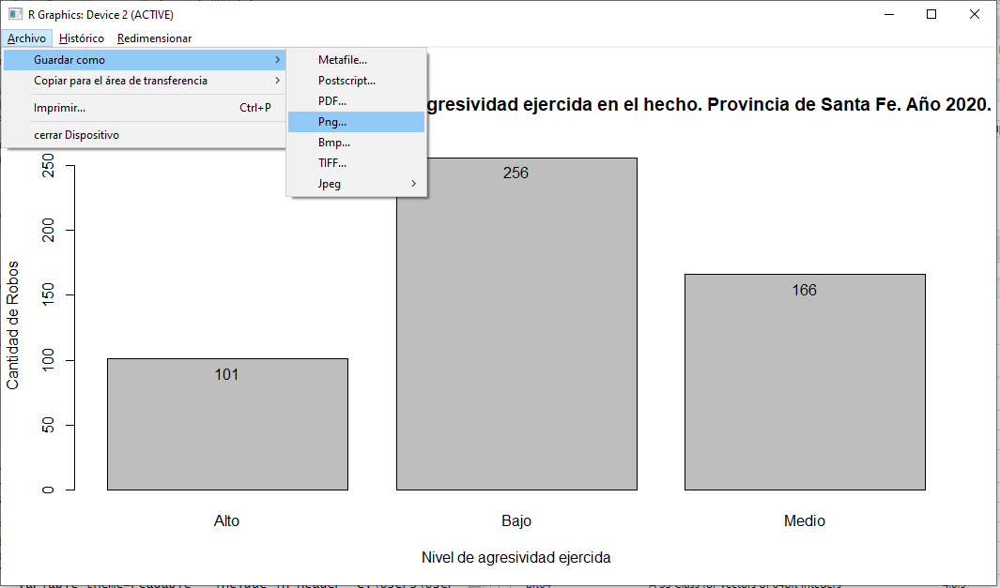
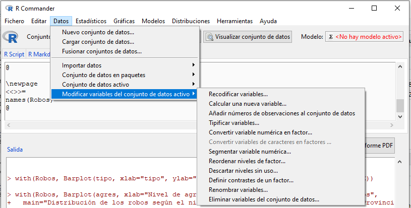
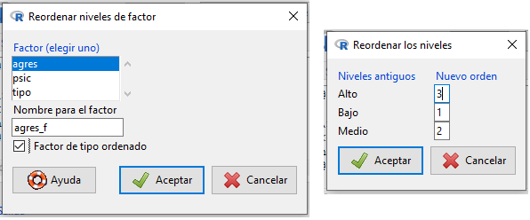
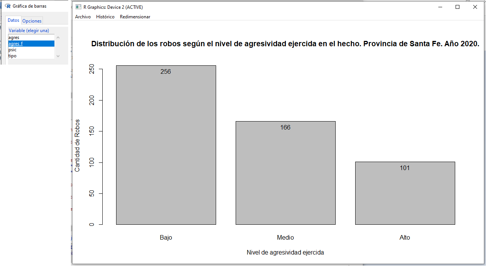
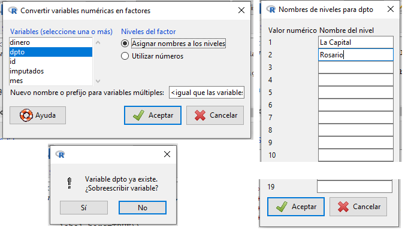

```{r setup, include=FALSE}
knitr::opts_chunk$set(echo = TRUE)
```

# Introducción

Uno de los objetivos principales del análisis del delito es convertir el torrente de datos que se generan de forma constante en las distintas fuentes (Central de Atención a la Emergencia 911, partes e intervenciones policiales sistematizadas en ACRIM, etc.) en información valiosa, para ser empleada en la toma de decisiones, caracterización de patrones, predicción de resultados, identificación de fuentes de variabilidad, detección de anomalías, etc. Estos conjuntos de datos deben ser procesados y depurados, organizados de alguna forma estructurada, para poder ser sometidos a los análisis que produzcan los resultados buscados. Finalmente, dichos resultados deben ser comunicados eficazmente para que se pueda accionar sobre la información producida.

Este documento se enfocará en el análisis descriptivo de características univariadas. Se enfocará en el uso del software R a través de su interfaz RStudio, dado que es una plataforma específica para el análisis estadístico y la representación gráfica. Si bien los soportes informáticos tipo planillas de cálculo (tipo Microsoft Excel, Libre Office, Google Drive) también brindan algunas herramientas que nos pueden ser útiles, en principio no serán objeto de este documento. 

# Datos a trabajar

Para el abordaje de esta unidad, trabajaremos con un conjunto de datos simulados, es decir, creados artificialmente mediante la computadora en base a ciertas características que elegimos. Se trata de un conjunto de datos que imita información sobre robos cometidos a viviendas durante el año 2020 en la provincia de Santa Fe. El archivo que contiene estos datos es `base_robos.xlsx`, y cuenta con las siguientes características:

```{r echo=F}
vbles <- t(rbind(
  c("ID", "mes", "tipo", "dinero", "imputados", "agres", "psic", "dpto"),
  c("Número único de identificación del hecho.", 
    "Mes en que ocurrió el robo, codificado con números enteros donde 1: Enero, ..., 12: Diciembre.", 
    "Tipo de robo (Simple/calificado).", 
    "Cantidad de dinero sustraído en el hecho (en $ argentinos).", 
    "Cantidad de presuntos involucrados en el hecho.", 
    "Nivel de agresividad ejercida en el hecho (Bajo/Medio/Alto)",
    "Necesidad de asistencia psicológica al grupo familiar víctima del robo como consecuencia del hecho (Sí/No).", 
    "Departamento en que ocurrió el hecho, codificado con números enteros donde 1: La Capital, 2: Rosario, ..., 19: Vera.")
))

knitr::kable(vbles, col.names = c("Variable", "Descripción"))
```

> **Ejercicio 1...** 
> (a) En la realidad, ¿sería factible recolectar toda esta información? ¿A qué fuente/s podríamos recurrir?
> (b) ¿Qué tipo de variables son las mencionadas? Clasificalas. ¿Qué tipo de análisis descriptivos podrían realizarse sobre cada una de ellas?


# Primeros pasos con R

En primer lugar, tenés que abrir RStudio. Esto lo podés hacer desde el programa instalado en tu computadora (si todavía no lo hiciste, podés recurrir al material disponible en el aula virtual con los links de descarga de R y `RStudio`) o bien podés hacerlo a través de <https://rstudio.cloud/>, que es algo así como un google Drive de R. Podés crear tu propia cuenta, asociándola a Google o GitHub si contás con una cuenta en alguna de estas plataformas o bien crearla desde cero como cualquier cuenta nueva en cualquier sitio. Una vez que abras la aplicación, debería verse así:

```{r, echo=F, fig.align='center'}
knitr::include_graphics("r_inicio.png")
```

Haciendo click en el primer ícono de la barra de herramientas `New file` o yendo a `File > New File > R Script` se abrirá un script de R: una especie de block de notas insertado en la interfaz de R donde vamos a escribir el código a ejecutar. Si bien el código de R se puede ejecutar directamente desde la consola, en general nos va a interesar guardar nuestros proyectos y el código ejecutado para poder replicarlo. Ahora ya tenemos listo el programa para ser usado.

# Carga de datos

Dado que R es un lenguaje de programación orientado a objetos, todo lo que necesitamos para trabajar necesita ser creado como un objeto en nuestro ambiente de trabajo (panel superior derecho, en la pestaña *Environment*). ¿Qué queremos decir con esto? Así como para poder trabajar en la computadora necesitamos que los archivos estén creados y estén ubicados en algún lugar del disco rígido, R necesita a su vez algo similar: que todo lo que trabajemos exista en el entorno de trabajo de R (Environment) y para ello debemos crear distintos objetos (como archivos propios de R). Asimismo, R trabaja con memoria temporal, por lo que podemos crear objetos en el ambiente de trabajo que no se traduzcan necesariamente en un archivo alojado en nuestra computadora. Ya veremos cómo funciona esto.

Para poder trabajar con un conjunto de datos, lo primero que necesitamos hacer es hacerlo disponible para R. Para eso, en primer lugar necesitamos identificar en qué formato está el conjunto de datos que necesitamos trabajar. Si bien en este caso trabajaremos con un archivo de tipo `.xlsx` (generado a partir de las versiones más nuevas de Microsoft Excel), R admite gran veriedad de formatos. Los más básicos y recomendables para grandes volúmenes de datos son los archivos `.csv` (*Comma Separated Values*) y archivos de texto plano tipo `.txt`. Asimismo, R permite cargar datos a su entorno de trabajo que estén nativamente en formatos provenientes de otros programas (SPSS, SAS, Stata). Si bien estos son los formatos que RStudio incluye en su interfaz de importación de datos, en [esta *cheatsheet*](https://evoldyn.gitlab.io/evomics-2018/ref-sheets/R_data-import.pdf) (traducción del inglés de "machete", de los que usan lxs chicxs en las escuelas) pueden encontrar otros formatos y herramientas de importación de datos. 

Entonces, desde el espacio de trabajo (bloque superior derecho en RStudio: 

```{r, echo=F, fig.align='center', out.width="60%"}
knitr::include_graphics("import.png")
```

Allí elegiremos la opción `From Excel...`, pero esto dependerá del tipo de archivo con el que necesitemos trabajar. Allí se desplegará una nueva ventana que se verá algo así:

```{r, echo=F, fig.align='center'}
knitr::include_graphics("import2.png")
```

En el primer campo que aparece debemos buscar la ubicación del archivo que queremos cargar en nuestra computadora. Si bien en este caso necesitamos que el archivo esté descargado en algún lugar de nuestro disco rígido, también pueden importarse de forma automática archivos que se encuentren disponibles en [internet](http://rstadistica.blogspot.com/2015/11/importar-desde-internet.html) o bien que se encuentren alojados en una [hoja de cálculo de Google Drive](https://www.doctormetrics.com/conectar-googlesheets-con-r/) (aunque estas formas exceden el presente curso, en internet hay mucho material al respecto, solo dejamos algunos links de ejemplo).

Una vez que se seleccionó el archivo que se va a cargar, en el segundo espacio se visualizará cómo será cargado el conjunto de datos en función de las configuraciones que determinemos en el punto 3. Es como una vista previa de la importación. Aquí podemos ver los primeros registros (esto es sumamente útil para verificar si la codificación del archivo es la correcta, si el separador decimal es el adecuado en caso de tener variables con posiciones decimales, y para tener una vista general de cómo se importarán nuestros datos), los nombres de las variables y el tipo de variable que reconoce automáticamente R para cada columna: *double* refiere a un campo cuantitativo y *Character* refiere a un campo de tipo texto (si bien hay otros tipos de datos, estos son los más utilizados, junto con los campos lógicos de tipo verdadero/falso o los campos tipo fecha). Es importante detectar cómo interpreta R los datos que cargamos: si no lee bien las variables cuantitativas y, por ejemplo, las interpreta como texto, entonces no podremos realizar operaciones matemáticas sobre estas. También tendremos que tener cuidado con las variables categóricas que estén codificadas con valores, como en el caso del departamento del hecho, dado que el programa podrá hacer operaciones matemáticas con los valores cuando en realidad no tienen sentido. Una última cuestión a tener en cuenta tiene que ver con las variables categóricas ordinales: R por defecto ordena los campos tipo texto en orden alfabético, por lo que variables del tipo Bajo/Medio/Alto (como el nivel de agresividad del hecho) serán ordenadas por defecto como Alto/Bajo/Medio, perdiendo el orden natural de las categorías. Todas estas cuestiones pueden modificarse y reprogramarse, pero no debemos perderlas de vista y tenemos que estar atentxs desde el momento inicial de la carga de datos.

Dentro de las opciones de importación (tercer bloque) aparecen algunas cuestiones que podemos modificar sobre la importación:

* el nombre que se le asignará al objeto que crearemos, en este caso `Robos`
* la hoja que se importará, por defecto es la primera,
* el rango de la hoja de datos a importar, en caso de que no querramos importar la hoja completa sino un subconjunto de celdas,
* la cantidad máxima de filas a leer, en caso de no especificarse el rango,
* si hay que omitir algunas filas -Skip-, 
* cuáles serán los valores perdidos `NA`: algunas veces en las hojas de cálculo en las que manipulamos los datos, indicamos los valores faltantes con caracteres como, por ejemplo, un punto o un guión. Esto es lo que hay que indicar allí en esos casos, para que el programa considere esos casos como datos faltantes y no modifique el tipo de variable al encontrar caracteres "raros" (por ejemplo, al encontrar un guión en una variablen numérica, podría considerar que se trata de un campo de tipo texto/caracter ya que encontró un registro que no tiene un valor numérico),
* si la primera fila contiene los nombres de las columnas, y
* si R nos debe abrir el visualizador una vez que cargue la base.
  
En el cuarto y último panel, queda constancia del código que se genera con todas estas opciones que seteamos manualmente. Además de las mencionadas, hay otras opciones posibles para configurar a la hora de importar un conjunto de datos. Dado que una de las principales ideas del R es la reproducibilidad, lo aconsejable siempre es conservar el código, copiándolo y pegándolo en nuestro script. De este modo, si esta base de robos se actualizara (por ejemplo) de forma semanal o diaria, con solo ejecutar el código guardado (siempre que el archivo se guarde en el mismo formato, en la misma ubicación y con el mismo nombre) podremos cargar el conjunto de datos actualizado.

Una vez que se halló la configuración adecuada para cargar nuestra base de datos, entonces este código puede conservarse para ocasiones futuras, tal como se dijo antes. En mi caso, tiene la siguiente forma:

```{r echo = T, message=F, warning=F}
library(readxl)
Robos <- read_excel("base_robos.xlsx")
```

`readxl` es el paquete que usamos para importar los datos desde un archivos de Microsoft Excel: una vez que lo instalamos debemos llamarlo (abrir la aplicación) para poder usarlo y ello se hace con la función `library(...)`. Luego, `Robos` es el nombre que yo asigno al objeto creado en R que almacena mis datos, con el que voy trabajar de aquí en adelante. Estos datos fueron traídos desde el archivo `base_robos.xlsx`.


# Paquetes

Otro aspecto a tener en cuenta es que R es un lenguaje de programación que funciona a través de **paquetes**. Los paquetes son conjuntos de funciones específicas, que deben descargarse en la computadora la primera vez que queremos usarlos y deben "llamarse" cada vez que los necesitemos en una nueva sesión de R. Funcionan como las aplicaciones del celular: para poder usarlas tenemos que instalarlas una primera vez, y una vez que está instalada tenemos que abrirla para poder usarla. Y un dato más: así como es importante tener actualizadas las aplicaciones del celu para tener todas las funciones al día, lo mismo ocurre con los paquetes, que se van actualizando con el paso del tiempo, y con el mismo cerebro de R que también debe actualizarse de vez en cuando.

Puede que la primera vez que querramos cargar un conjunto de datos desde un archivo Excel no podamos hacerlo por que no tenemos instalado el paquete `readxl`, que contiene la función necesaria para poder hacerlo. En la pestaña `Packages` del panel inferior derecho podemos instalar los paquetes deseados. Picamos la opción `Install` y allí en la ventana emergente que se habilita comenzamos a tipear el nombre del paquete deseado. Una vez que lo encontramos, procedemos a instalarlo. Cuando esto ocurra, probablemente aparezcan varias ventanas emergentes que se abren y cierran de forma veloz, esto es completamente normal mientras dure el proceso de instalación.

```{r, echo=F, fig.align='center', out.width="60%"}
knitr::include_graphics("pack.png")
```

```{r, echo=F, fig.align='center', out.width="50%"}
knitr::include_graphics("pack2.png")
```

Una vez que tenemos el paquete instalado podemos importar nuestro conjunto de datos, y podemos solicitar ayuda en la pestaña `Help` del panel inferior derecho o bien escribiendo en la consola (panel inferior izquierdo, pestaña `Console`) algo así: `?read_excel`, lo que activará automáticamente la pestaña de ayuda. Para que esto funcione, necesitamos tener conexión a internet. 

Asimismo, recuerden que en la web hay gran cantidad de material disponible y muchos foros donde en general ya se han preguntado todas las preguntas que nos hacemos ahora.

# Primeros pasos: R commander (RCmdr)

Si bien R tiene una comunidad de usuarios muy activa (en el sitio <https://renrosario.rbind.io> pueden encontrar a la comunidad de usuarixs de R en Rosario), de las más diversas áreas, con muchos blogs, portales y encuentros en persona para recibir ayuda, al tratarse de un lenguaje de  programación, su  uso implica tener que aprender sentencias y códigos especiales para indicarle al software qué debe realizar. Esto puede ser desafiante, especialmente si no se tiene experiencia previa en el mundo de la programación.

**R Commander** existe para poder usar R sin tener que aprender programación. Se trata de una interfaz  gráfica que permite realizar algunas tareas en base a  menúes y ventanas, como suele hacerse en muchos otros softwares con licencia paga. Esto significa que, a pesar de tener algunas limitaciones, podemos usar R reemplazando las sentencias de programación por ventanas y opciones que podemos elegir con el mouse.

Para poder usar R Commander debemos instalarlo. Dado que se trata de un paquete, como los que mencionamos con anterioridad, podremos instalarlo yendo a la pestaña `Packages` del panel inferior derecho, y una vez allí clickeando en el botón `Install` y tipeando `Rcmdr`. Puede que aparezcan algunos carteles y ventanas emergentes durante el proceso de instalación del paquete, es lo esperable. Una vez finalizado este proceso, podemos "llamar" al paquete escribiendo en la consola (panel inferior izquierdo) `library(Rcmdr)`:

```{r, echo=F, fig.align='center', out.width="100%"}
knitr::include_graphics("rcmdr1.png")
```

Una vez escrito esto, hacemos *enter*. R comenzará a "pensar" e irá escribiendo algunas cosas en rojo en la ventana de la consola. Ello indica que está cargando los paquetes necesarios para poder ejecutar el R Commander, ya que esta interfaz gráfica hace uso de otros paquetes y procedimientos por lo que al usarlo se habilitan éstos también. Finalmente, se abrirá una ventana emergente como la que sigue:

```{r, echo=F, fig.align='center', out.width="100%"}
knitr::include_graphics("rcmdr2.png")
```

Tal como indicamos en el apartado de **Paquetes**, el proceso de instalación se realiza solo una vez (la primera que se usa). A partir de este momento, cada vez que querramos utilizar R Commander deberemos repetir este último proceso: escribir `library(Rcmdr)` en la consola y apretar *enter*.

## Componentes de R Commander

En la ventana de R Commander se pueden distinguir 4 partes:

```{r, echo=F, fig.align='center', out.width="70%"}
knitr::include_graphics("rcmdr3.png")
```

* 1) La barra de menúes Fichero, Editar, Datos, etc., que nos permitirán realizar distintas actividades.

* 2) El sector de instrucciones o de código de R, llamado RScript. Cada vez que se ejecuta alguna acción del menú, R Commander traducirá dicha acción al lenguaje R y aparecerá en este sector. No tendremos que preocuparnos por su contenido.

* 3) El sector de resultados, Salida. En general, cualquier resultado de R Commander será mostrado aquí.

* 4) El sector de Mensajes. Sirve para que R Commander informe sobre cualquier aspecto, especialmente sobre errores cometidos.

Algunas veces, los apartados 3) y 4) no aparecen, y solo se puede ver la barra de arriba con el menú de opciones y el RScript. En estos casos, tanto el código como los avisos se visualizan en la consola de RStudio (esta es la opción por defecto dado que estamos utilizando RStudio, cosa que no ocurriría si estuviésemos usando directamente R desde su propia interfaz). Para cambiar esta configuración y que todo pueda verse desde la ventana de R Commander, vamos a Herramientas > Opciones, y en la pestaña Salida destildamos la opción "Enviar la salida a la consola de R" y tenemos que asegurarnos que la ventana de salida tenga un alto (en líneas) superior a 0; clickeamos Reiniciar R Commander.

```{r, echo=F, fig.align='center', out.width="70%"}
knitr::include_graphics("rcmdr26.png")
```

## Lectura de datos

Para poder realizar gráficos y resu´menes numéricos, debemos primero importar o abrir en R Commnader el archivo que contenga los datos que queremos analizar. Si bien los datos pueden estar guardados en distintos tipos de archivos y formatos, vamos a considerar un ejemplo en el que los mismos fueron guardados en una planilla de Excel. El archivo de Excel que vamos a utilizar es una base de datos simulada llamada robos.xlsx 

La siguiente figura muestra esta planilla de datos en Excel:

```{r, echo=F, fig.align='center', out.width="50%"}
knitr::include_graphics("rcmdr4.png")
```

Este conjunto de datos se dice que está ordenado, ya que cada variable se encuentra en una columna y cada fila hace referencia a un caso o sujeto (en este caso el robo). Para leer este archivo de datos desde R Commander, se deben seguir los siguientes pasos:

* Ir a: Datos > Importar datos > desde un archivo de Excel...

```{r, echo=F, fig.align='center', out.width="70%"}
knitr::include_graphics("rcmdr5.png")
```

* En la ventana Importar un  conjunto  de  datos  Excel, podemos elegir el nombre con el cual vamos a identificar al conjunto de datos que vamos a importar. Dicho de otro modo, elegimos el nombre que queremos para el nuevo objeto de R que estamos creando, que contiene todos nuestros datos. Se puede dejar el que aparece por default (Dataset) o elegir cualquier otro. En este caso tipeamos Robos.

```{r, echo=F, fig.align='center', out.width="50%"}
knitr::include_graphics("rcmdr6.png")
```

* Al hacer click en *Aceptar*, se abrirá un explorador de archivos para que busquemos y seleccionemos el archivo `base_robos.xlsx` dentro de nuestra computadora.

* Luego de hacer click en Abrir, tanto en el sector de código como en el de resultados aparecerán las sentencias de programación que el programa evaluó para realizar la importación. Las mismas no son de nuestro interés, pero podemos verificar que la lectura fue exitosa si aparece el nombre elegido (Robos) al lado de Conjunto de datos: en la parte superior. Además, si hacemos click sobre Visualizar conjunto de datos, se abrirá una nueva ventana que nos permite ver el conjunto de datos:

```{r, echo=F, fig.align='center', out.width="70%"}
knitr::include_graphics("rcmdr7.png")
```

## Gráficos

En R Commander, los gráficos disponibles se encuentran en el menú Gráficas. Entre ellos están el histograma, el gráfico de bastones, el diagrama de cajas (boxplot), el gráfico de barras y el gráfico de sectores. 


### Gráfico de sectores

Para realizar un diagrama de sectores mediante R commander elegiremos la opción Gráficas >  Gráfica de sectores. En la ventana emergente se selecciona una variable cualitativa, por ejemplo, *tipo*. Además, podemos escribir un título para el gráfico en el cuadro correspondiente.

```{r, echo=F, fig.align='center', out.width="50%"}
knitr::include_graphics("rcmdr8.png")
```

Al hacer click en Aceptar, se abre una nueva ventana llamada R Graphics Device, en la cual se presentarán todos los gráficos que realicemos. En este caso, el resultado obtenido es:

```{r, echo=F, fig.align='center', out.width="70%"}
knitr::include_graphics("rcmdr9.png")
```

### Gráfica de barras

Para obtener un gráfico de barras se selecciona: Gráficas >  Gráfica de barras. En la pestaña Datos de la ventana que se abrió, seleccionar la variable cualitativa de interés, por ejemplo “agres”:

```{r, echo=F, fig.align='center', out.width="50%"}
knitr::include_graphics("rcmdr10.png")
```

Dentro de la pestaña Opciones es posible configurar algunas cuestiones, por ejemplo, graficar las frecuencias absolutas o las relativas porcentuales, emplear barras subdivididas o agrupadas, definir los nombres de los ejes y el título del gráfico, etc. Para hacer un gráficos de barras simples, dejamos las opciones por defecto tal como aparecen y sólo modificamos los nombres de los ejes y el título:

```{r, echo=F, fig.align='center', out.width="50%"}
knitr::include_graphics("rcmdr11.png")
```

```{r, echo=F, fig.align='center', out.width="70%"}
knitr::include_graphics("rcmdr12.png")
```

> *A tener cuidado*
> ¿Les parece completamente correcto el gráfico que acabamos de construir?
> Más adelante veremos cómo manipular los datos para que R los contemple de forma correcta.

### Gráfico de bastones

Para realizar un gráfico de bastones de una variable discreta se selecciona Gráficas > Dibujar una variable numérica discreta y elegimos la variable que nos interesa, por ejemplo, imputados, en la pestaña Datos. En la pestaña Opciones se puede determinar la escala para el eje vertical (frecuencia absoluta o frecuencia relativa porcentual), los nombres para los ejes y el título.

```{r, echo=F, fig.align='center', out.width="100%"}
knitr::include_graphics("rcmdr13.png")
```

```{r, echo=F, fig.align='center', out.width="70%"}
knitr::include_graphics("rcmdr14.png")
```

### Histograma 

Para realizar un histograma de una variable cuantitativa continua (o una discreta con muchos valores distintos), vamos a Gráficas   >Histograma y elegimos la variable que nos interesa, por ejemplo, dinero, en la pestaña Datos. En la pestaña Opciones se puede determinar el nu´mero de intervalos o clases (en este caso dejamos por defecto el que ofrece el programa) y la escala para el eje vertical (frecuencia absoluta o frecuencia relativa porcentual).

```{r, echo=F, fig.align='center', out.width="100%"}
knitr::include_graphics("rcmdr15.png")
```

```{r, echo=F, fig.align='center', out.width="70%"}
knitr::include_graphics("rcmdr16.png")
```

### Diagrama de caja (Boxplot)

Para obtener un diagrama de caja o boxplot se debe ir a Gráficas >  Diagrama de caja. En la pestaña Datos de la nueva ventana elegimos la variable de interés, por ejemplo, Dinero. En la pestaña Opciones podemos elegir nombres de ejes y título del gráfico.

```{r, echo=F, fig.align='center', out.width="50%"}
knitr::include_graphics("rcmdr17.png")
```

```{r, echo=F, fig.align='center', out.width="70%"}
knitr::include_graphics("rcmdr18.png")
```

### Modificar paleta de colores

R Commander nos permite modificar la paleta de colores de nuestro análisis de datos. Dentro del menú `Gráficas`, la primer opción es **Elegir la gama de colores**. Si clickeamos allí, se abrirá una ventana que muestra la actual paleta de colores y permitirá modificarla, eligiendo los colores deseados. Finalmente, damos aceptar, y podemos repetir los gráficos para ver cómo cambió. Este paso se realiza al comienzo, para que todos los gráficos se creen con la paleta de colores deseada.

### Guardar los gráficos en archivo

Una vez que generamos los gráficos en RCommander, necesitamos llevarlos a nuestros informes. Una forma posible se abordará en la sección RMarkdown (informes automatizados). Otra forma posible es copiando las figuras y pegándolas en nuestro informe de Documento de Libre Office o de Microsoft Word (que suelen ser el formato más habitual) o bien guardando los gráficos como imágenes y luego insertándolos en el documento.

En la ventana R Graphics: Device podemos acomodar las dimensiones del visualizador para que el título entre correctamente y darle la forma que querramos (más o menos ancho, más o menos alto) al redimensionar la ventana. Para copiar y pegar el gráfico, vamos al menú Archivo > Copiar para el área de transferencia > Como un bitmap, y una vez hecho esto podremos ir a nuestro documento y simplemente pegarlo (`Ctrol + V` en la mayoría de las interfaces, o bien desde el menú `Editar`).

```{r, echo=F, fig.align='center', out.width="100%"}

```

Asimismo, para guardar la imagen vamos a Archivo > Guardar como y elegimos el formato deseado. En este caso, yo elegí un formato .png. Para los archivos .jpeg permite elegir además al calidad con la que se guardará el elemento.

```{r, echo=F, fig.align='center', out.width="100%"}

```

## Cálculo de estadísticas descriptivas

R Commander provee una forma rápida de resumir las principales características de un conjun- to de datos, indicando el mínimo, máximo, media y cuartiles para todas las variables cuantitativas y la frecuencia absoluta de cada categoría para las variables cualitativas. Esto se obtiene yendo a Estadísticos >  Resúmenes >  Conjunto de datos activo:


```{r, echo=F, fig.align='center', out.width="70%"}
knitr::include_graphics("rcmdr19.png")
```

El resultado se muestra en el sector Salida:

```{r, echo=F, fig.align='center', out.width="70%"}
knitr::include_graphics("rcmdr20.png")
```

### Variables cuantitativas

Si se quiere calcular otras estadísticas para resumir variables cuantitativas, se debe ir a Estadísticos >  Resúmenes >  Resúmenes numéricos:

```{r, echo=F, fig.align='center', out.width="70%"}
knitr::include_graphics("rcmdr21.png")
```

Se abre la ventana Resúmenes numéricos. En la pestaña Datos, seleccionar (hacer click) sobre la variable cuantitativa que deseemos resumir, por ejemplo, imputados. En la pestaña Estadísticos, seleccionar las estadísticas de interés. Desviación típica es el desvío estándar muestral y lo que figura en el cuadro Cuantiles 0, .25, .5, .75, 1 significa que nos informará el mínimo, Q1, Q2, Q3 y el máximo:

```{r, echo=F, fig.align='center', out.width="100%"}
knitr::include_graphics("rcmdr22.png")
```

Luego de hacer click en Aceptar, obtendremos las estadísticas en el sector Salida. mean es la media aritmética, sd es el desvío estándar, IQR es el rango intercuartil, cv es el coeficiente de variación, 0 % es el mínimo, 25 % es el Q1, 50 % es el Q2, 75 % es el Q3, 100 % es el máximo y n es la cantidad de observaciones.

```{r, echo=F, fig.align='center', out.width="100%"}
knitr::include_graphics("rcmdr23.png")
```

### Variables cualitativas

También podemos generar la distribución de frecuencias para una variable cualitativa. Esto se encuentra en Estadísticos >  Resúmenes >  Distribución de frecuencia. En la ventana Distribución de frecuencias, seleccionar la variable cualitativa que se desea resumir, por ejemplo, agres. Al hacer click en Aceptar, en el sector Salida encontraremos las frecuencias absolutas de cada categoría (Counts) y las frecuencias relativas porcentuales (percentages):

```{r, echo=F, fig.align='center', out.width="70%"}
knitr::include_graphics("rcmdr24.png")
```

## Manipulación de datos y configuración de variables

Cuando construimos el gráfico de barras para la variable Nivel de agresividad, las barras del gráficos quedaron "desordenadas": primero la barra del nivel Alto, después la del nivel Bajo y por último la del nivel Medio.

```{r, echo=F, fig.align='center', out.width="70%"}
knitr::include_graphics("rcmdr12.png")
```

¿Por qué ocurre esto? Por defecto, para las variables tipo carácter R ordena las categorías alfabéticamente. Entonces, antes de realizar el análisis descriptivo gráfico y numérico tenemos que indicarle a R la naturaleza de cada una de las variables para no incurrir en errores. Algo similar ocurre con la variable que indica el departamento en que ocurrió el hecho: dado que está codificada con valores numéricos del 1 al 19, al calcular las medidas descriptivas R nos estimó el valor mínimo, máximo, promedio.... ¿y qué sentido tiene hablar del departamento promedio? El programa hace lo que nosotros le pedimos, y en este caso calculó las medidas resumen de la variable departamento como cualquier otra variable numérica.

```{r, echo=F, fig.align='center', out.width="70%"}
knitr::include_graphics("rcmdr29.png")
```

Entonces, para configurar las variables tenemos que ir al menú Datos y en la opción Modificar variables del conjunto de datos activo encontraremos las opciones que necesitemos.

```{r, echo=F, fig.align='center', out.width="70%"}

```

Para casos como los de la variable nivel de agresividad, variable tipo caracter para la cual necesitamos ordenar sus categorías, iremos a la opción "Reordenar niveles de factor". Para R, y en la estadística en general, las variables cualitativas son llamadas factores.

En la ventana emergente que se abre al clikear la opción Reordenar niveles de un factor..., tenemos que elegir cuál es la variable sobre la cual queremos trabajar (en este caso, agres). Adicionalmente, RCommander nos permite guardar la modificación que hagamos en una nueva variable que se creará de forma automática en el conjunto de datos, en este caso con el nombre agres_f. Esta opción suele ser útil cuando no se quiere modiicar los datos originales, y al hacer esto el conjunto de datos ahora tendrá dos variables que refieren a la misma característica: agres y agres_f, que se ven igual si abrimos el conjunto de datos pero se diferencian en la forma en que son analizados los datos. Caso contrario, la opción por defecto es reemplazar los datos originales. Sea cual sea la opción elegida, tenemos que indicarle a RCommander que queremos un "Factor de tipo ordenado", tildando la opción correspondiente. Al hacer click en Aceptar, se abrirá una segunda ventana que nos permitirá elegir el orden de nuestras categorías.

```{r, echo=F, fig.align='center', out.width="70%"}

```

Si ahora repetimos el análisis descriptivo gráfico (en mi caso, con la variable agres_f), las barras quedarán ordenadas como queríamos.

```{r, echo=F, fig.align='center', out.width="100%"}

```

Un proceso distinto tenemos que seguir en el caso de la variable departamento, ya que no se trata originalmente de un campo tipo caracter sino que es un campo numérico que representa categorías. En este caso, en el menú `Datos > Modificar variables del conjunto de datos activo` pero ahora eligiendo la opción `Convertir variables numéricas en factores...`, se abrirá una ventana emergente para elegir la variable que queremos convertir en factor. Seleccionamos `dpto` y dejamos marcada la opción `Asignar nombres a los niveles`. En este caso, con fines didácticos elegimos no crear una variable nueva sino modificar la ya existente (el cambo `Nuevo nombre ...` queda con la opción por defecto). En sus trabajos, recomendamos seguir siempre el mismo criterio. Al darle aceptar nos preguntará si realmente queremos reemplazar los datos originales, le damos  `Sí`. Es importante aclarar que **esta modificación de los datos se hace sobre el archivo `Robos`, el objeto creado en la memoria de R, y no sobre el archivo `base_robos.xlsx`** del cual importamos los datos (podemos abrirlo y corroborar que no se agregó la variable `agres_f` creada en el paso anterior). Con esto nos referimos a que **R trabaja con objetos guardados en su memoria temporal**.

Ahora bien, al aceptar la modificación de nuestros datos, se abre una nueva ventana donde podemos escribir las etiquetas que queremos para cada número. Entonces, en cada campo indicamos el nombre del departamento correspondiente: para el valor 1 será La Capital, para el valor 2 será Rosario, y así con todos. Finalmente, aceptamos.

```{r, echo=F, fig.align='center', out.width="70%"}

```

> **Ejercicio 2**
> Preparar el conjunto de datos para un análisis descriptivo completo, recodificando las variables que sean necesarias. Una vez hecho esto, hacer el análisis descriptivo de cada variable, incluyendo tanto la parte gráfica como numérica. No olvide incluir los nombres de los ejes y un título apropiado para cada figura, y las unidades de medida correspondientes en caso de corresponder.

> **Ejercicio 3**
> Sobre el análisis descriptivo realizado previamente, intercale los gráficos creados con el texto que incluya las interpretaciones correspondientes en términos del problema. Indique además qué medida de posición central es más apropiada para cada variable, y en caso de corresponder indicar también qué medida de dispersión la podría acompañar.


## Cerrar R Commander

Como con cualquier otro programa, para cerrar R Commander debemos hacer click en la cruz que se presenta en su ventana en la esquina superior derecha. Sin embargo, R Commander nos hará algunas preguntas, empezando por si realmente queremos salir (Aceptar) y varias otras acerca de que si queremos guardar archivos con lo que estuvimos haciendo: con el archivo de instrucciones, se refiere al código que estuvimos generando a medida que fuimos trabajando (RScript); lo que refiere al fichero R Markdown lo veremos en la sección que sigue; y con el archivo de salida se refiere a un archivo de texto plano .txt que contiene todo lo que se fue generando en la ventana Salida (el código que escribió RCommander a medida que fuimos realizando el análisis y los resultados del análisis descriptivo numérico, los gráficos no podrá guardarlos dado que no pueden convertirse a texto).

```{r, echo=F, fig.align='center', out.width="70%"}
knitr::include_graphics("rcmdr25.png")
```

Si bien en este apartado del documento no nos centramos en el código ejecutado, guardar las instrucciones (el RScript) puede ser muy útil si el análisis de datos que estamos haciendo es una tarea repetitiva en nuestra rutina. Guardando el código de programación que hace todo lo que estuvimos trabajando, nos permite volver a abrirlo en un futuro y poder repetir lo ya hecho. Esto puede ser particularmente útil si, por ejemplo, se trata de un análisis que se realiza de forma periódica (por ejemplo, semanalmente, quincenalmente, mensualmente) sobre una misma base de datos que se va actualizando. En este caso, y si nos interesa guardar antes este RScript, podemos ir a `Fichero > Guardar las instrucciones como...` y asignarle un nombre al archivo. Esto se guardará como un archivo con extensión `.R`: es un archivo que contiene todo el código (y solo eso, ninguno de los resultados obtenidos) y que puede abrirse desde R, RStudio o bien también desde un lector de archivos de texto plano (como el block de notas). 

Si cerramos nuestra sesión de RCommander y RStudio, y otro día queremos volver a este Script, volvemos a abrir RCommander y yendo a `Fichero > Abrir archivo de instrucciones...` y allí seleccionamos el archivo en nuestra computadora, y podremos ver que en el panel de RScript, se cargará todo el código creado previamente. Para volver a ejecutar una parte del RScript, podemos seleccionar las líneas de código correspondientes y hacer click en el botón `Ejecutar`. Para ello es necesario primero analizar un poco qué parte del código corresponde a cada cosa. Por ejemplo, en este caso, selecciono las líneas que corresponden al gráfico de barras (lo noto dado que usa una función llamada `Barplot`) para la variable `agres_f`.

```{r, echo=F, fig.align='center', out.width="70%"}
knitr::include_graphics("rcmdr34.png")
```

A partir del apartado **Modificando el código: paquete base** hay más nociones para poder interpretar el código de R.

## R Markdown

Apartado en construcción...

```{r echo=F, eval=F}

Hasta ahora creamos gráficos y obtuvimos algunas medidas resumen y tablas, que nos permiten describir el conjunto de datos abordado. Sin embargo, un conjunto de figuras sin sus correspondientes lecturas o interpretaciones es incompleto. Además, estuvimos suponiendo que usamos R para analizar los datos y un procesador de texto para crear el informe correspondiente. 

R provee un complemento llamado **R Markdown**, que permite crear reportes en .pdf, .html, .ppt y varios formatos más combinando análisis realizado en R (traducido en líneas de código) y texto (por ejemplo interpretaciones, títulos, etc.). Para esto, necesitamos guardar lo ya hecho en un formato compatible con R Markdown (el resultado es un archivo de extensión .Rmd en nuestra computadora), y eso puede hacerse desde `Fichero > Guardar fichero R Markdown...`. 

Asimismo, R Commander cuenta con una pestaña que nos permite editar de forma directa el código necesario del proyecto para poder incluir el texto que querramos intercalado con el análisis gráfico. Si vamos a la pestaña de R Markdown, veremos que el código incluido no es exáctamente igual al que aparece en la pestaña RScript.

#```{r, echo=F, fig.align='center', out.width="70%"}
#knitr::include_graphics("rcmdr35.png")
#```

La primera línea hace referencia a que el documento que se generará tomará el formato de una plantilla predeterminada (template). Esta plantilla es un documento de formato .Rmd que contiene las intrucciones de formato (tipo y tamaño de letra, márgenes, tamaño de página, interlineado, etc.). Pueden descargarse desde internet distintas plantillas, o pueden crearse plantillas propias si se maneja el lenguaje R, html o css.

La segunda línea, con el texto *"Replace with Main Title"* es el texto del documento. Puede modificarse a mano adecuándolo al nombre de nuestro trabajo o que querramos darle al documento. Por ejemplo, podemos ponerle "Introducción al análisis descriptivo con R Markdown".

La línea que sigue, con el texto *"Your Name"* refiere al o a los autores del documento. Allí pueden poner sus nombres, el del área en la cual trabajan, lo que deseen. Por ejemplo, podemos ponerle "San Martín/Ciccioli".

La última línea de las mostradas, con el texto *"`r as.character(Sys.Date())`"* está para imprimir la fecha de hoy (o sea, de cuando se ejecute el código).

> **Ejercicio 3**
> Sobre el análisis descriptivo realizado previamente, trabaje en la pestaña R Markdown para crear un reporte en PDF. Adecúe el encabezado con sus datos y el nombre del documento. Intercale los gráficos creados con el texto que incluya las interpretaciones correspondientes en términos del problema. Indique además qué medida de posición central es más apropiada para cada variable, y en caso de corresponder indicar también qué medida de dispersión la podría acompañar.


```


# Modificando el código: paquete base

Hasta ahora trabajamos con el R Commander, una interfaz por menúes que nos permite de forma sencilla generar gráficos, medidas descriptivas y algunos análisis estadísticos más. Sin embargo, R Commander no permite aprovechar al máximo las opciones de edición de R. Para ello, necesitamos comenzar a conocer y amigarnos con el código de programación. En esta sección del documento, vamos a cerrar R Commander y vamos a trabajar directamente en RStudio.

Al comienzo de este documento vimos como importar el conjunto de datos `base_robos.xlsx` como un objeto de R, y vimos que ese nuevo objeto (llamado en nuestro caso Robos) aparece en el ambiente de trabajo (Global Environment, en el panel superior derecho). Si todavía no lo cargamos, ejecutando el siguiente código podemos hacerlo:

```{r echo=T}
Robos <- read_excel("base_robos.xlsx")
```


## Análisis descriptivo numérico

Vamos a comenzar con el análisis descriptivo numérico que es más sencillo. Tenemos que tener en cuenta dos cuestiones que nos ayudarán a comprender el código de R.

Dado que el análisis de datos se realiza de forma separada para cada una de las variables, necesitamos ir llamándolas de forma individual. Para ello, utilizaremos la siguiente expresión `Robos$variable`: primero nombramos al objeto, luego con el signo pesos indicamos que vamos a tomar una de sus variables, y a continuación indicamos el nombre de la variable que querramos.

Por otro lado, R trabaja con funciones, que operan de forma similar a las funciones de las hojas de cálculo: tienen un nombre y argumentos. En este caso, todas las funciones toman sus nombres del inglés, al igual que sus argumentos. Sin embargo, seguramente cuando las comiencen a usar se familiarizarán rápidamente. De todas formas, en internet siempre hay ayuda de más para sacarnos las dudas que tengamos. Asimismo, para saber cómo opera cada función podemos recurrir a la ayuda oficial de R: en el panel inferior derecho, en la pestaña Help, podemos buscar el nombre de la función deseada y allí encontraremos una breve descripción de la función y de sus argumentos. En la mayoría de los casos, los argumentos vienen con opciones por defecto. Toda esta información cobrará más sentido cuando la veamos aplicada a continuación.

Todo el código que querramos ejecutar será escrito entonces en el panel superior izquierdo, el RScript nuevo que abramos. Tal como indicamos en el apartado de R Commander, estos RScripts pueden guardarse y volver a abrirse cuando sea necesario para repetir el análisis.

### Variables cuantitativas

Las funciones para calcular las medidas descriptivas básicas pueden utilizarse indicando nada más que los datos que querramos analizar. Por ejemplo, si quisiéramos las medidas descriptivas para la variable "dinero sustraído":

```{r echo=T}
# Valor mínimo
min(Robos$dinero)

# Valor máximo
max(Robos$dinero)

# Promedio
mean(Robos$dinero)

# Mediana
median(Robos$dinero)

# Valor máximo
sd(Robos$dinero)

```

Todo lo que aparece sombreado en gris es el código ejecutado. Los números que aparecen en los recuadros blancos son los resultados brindados por R. Para cada línea, 


# Un pasito más: ggplot

